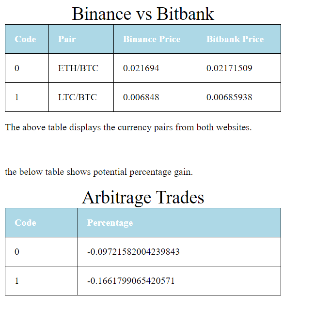

# Arbitrage Calculator

A web application that accesses API data from two cyptocurrency exchange websites (bitbank and binance) and gets the prices for two currency pairs (ETH/BTC and LTC/BTC) and displays this information in a table.  It then calculates the arbitrage percentage and displays this in the second table. 

This application was developed at the request of a friend who was interested in getting into arbitrage trading. The original plan was  to create a larger database of information from more websites and more currency pairs.  After i developed this application i had a better understanding of arbitrage trading. I then discussed the project with my friend again explaining that the risks were higher then previously thought and the profit margins were smaller. He unsurprisingly lost interest in the project.

This project was fun and short.  I had a chance to develop software in an area i was unfamiliar and was happy that i did.

Example trade: start with bitcoin on the bitbank website -> convert to ethereum -> transfer to binance -> convert back to bitcoin -> profit?

'Arbitrage' as defined by google: the simultaneous buying and selling of securities, currency, or commodities in different markets or in derivative forms in order to take advantage of differing prices for the same asset.

### Running Application

http://elliottblack.pythonanywhere.com/

## Built With

* [Python IDLE](https://www.python.org/) - python
* [Sublime Text](https://www.sublimetext.com/) - html

## Modules Used

* [Flask](https://www.fullstackpython.com/flask.html) - Web Framework
* [Flask-SocketIO](https://flask-socketio.readthedocs.io/en/latest/) - Web Socket
* [Requests](https://realpython.com/python-requests/) - HTTP requests
* [JSON](https://docs.python.org/3/library/json.html) - Data-interchange format

## Authors

* **Elliott Black** - *Software development* 

